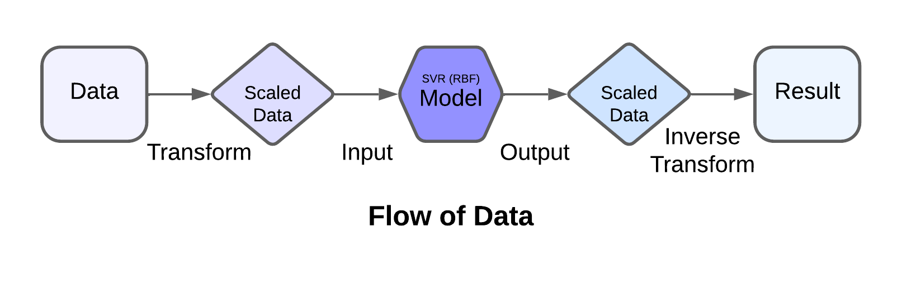

# What is Polynomial Regression?
Today we're venturing into the realm of Support Vector Regression (SVR), a technique closely related to Support Vector Machines (SVMs) used for classification tasks. SVR tackles the challenge of regression – predicting continuous outputs – while incorporating the strengths of SVMs. Here's a breakdown of the key concepts:

## The Core Idea
Unlike linear regression, which minimizes the overall error, SVR focuses on finding a hyperplane that minimizes the prediction error for a specific set of points while maximizing the margin around the hyperplane.
These specific points are called support vectors. They are the most influential data points that define the decision boundary (hyperplane) in SVR.
Mathematical Formulation (Simplified):

Imagine we have a dataset with input features (X) and target values (y). SVR aims to find a function f(X) that minimizes the following:

#### `L = 0.5 ||w||^2 + C * Σ |ε_i|`
`||w||^2`: Represents the complexity of the model (w is the weight vector).
`C`: Regularization parameter that controls the trade-off between model complexity and fitting the training data.
`Σ |ε_i|`: Sum of the absolute errors (ε) for all data points.

## Kernels and the High-Dimensional Trick:
- Linear regression works well for linearly separable data. However, real-world data is often non-linear.
- This is where kernels come into play. They are mathematical functions that implicitly map the input data into a higher-dimensional feature space where a linear relationship might exist.
- In essence, kernels allow SVR to find a linear separation in this high-dimensional space, even if the data is non-linear in the original input space.

### Common Kernel Functions:
- Linear Kernel: Suitable for (almost) linearly separable data.
- Polynomial Kernel: Captures non-linear relationships by raising the data points to a certain power.
- Radial Basis Function (RBF Kernel): A popular choice for non-linear data, known for its flexibility.

## Using SVR for AMD Stock Price Prediction:
In our case, we use SVR with an RBF kernel to predict the closing price (Close) of the AMD stock based on the manually added variable (Day). By selecting an appropriate kernel and tuning the hyperparameter `C`, we can create a model that captures the non-linear trends in the stock price data.
To understand the flow of the data in our code, take a look at this flowchart:

## Key Points to Remember:
- SVR focuses on minimizing error for a specific set of points (support vectors) while maximizing the margin.
- Kernels enable SVR to handle non-linear relationships in the data by implicitly transforming it into a higher-dimensional space.
- Choosing the right kernel and hyperparameter tuning are crucial for optimal SVR performance.
- By understanding SVR and its connection to kernels, you can unlock powerful tools for tackling regression problems with complex data structures!
- Lastly, we used the AMD stock data just for example. This does **not** imply that SVR is a good model to predict stock prices.

If you want to dig deeper and learn more about SVR, go through the resources given at the end and learn the concepts in depth.

Remember, practice makes one perfect, so grab your data and start exploring!

## Additional Resources

- [Scikit-Learn Documentation - Support Vector Regression](https://scikit-learn.org/stable/modules/svm.html#regression)
  - The official documentation of Scikit-Learn provides detailed information about Support Vector Regression (SVR) and its implementation in Python.
- [Medium - A Gentle Introduction to Support Vector Regression (SVR)](https://towardsdatascience.com/a-gentle-introduction-to-support-vector-regression-svr-a3ebc1672c2)
  - This article on Medium offers a gentle introduction to Support Vector Regression (SVR), explaining the concepts and providing practical examples.
- [Machine Learning Mastery - Support Vector Regression for Machine Learning](https://machinelearningmastery.com/support-vector-regression-for-machine-learning/)
  - Machine Learning Mastery provides a comprehensive tutorial on Support Vector Regression (SVR), including its theory, implementation, and tips for improving performance.
- [YouTube - Support Vector Regression Tutorial](https://www.youtube.com/watch?v=3liCbRZPrZA)
  - This YouTube tutorial provides an in-depth explanation of Support Vector Regression (SVR), covering theory, implementation, and practical examples.
- [Towards Data Science - Understanding the Radial Basis Function (RBF) Kernel](https://towardsdatascience.com/understanding-the-radial-basis-function-rbf-kernel-79f7f4e8ea14)
  - This article on Towards Data Science explains the Radial Basis Function (RBF) kernel, which is commonly used in Support Vector Regression (SVR), with clear examples and illustrations.
- [Stanford University - CS229: Machine Learning - Support Vector Machines](https://cs229.stanford.edu/notes/cs229-notes3.pdf)
  - The lecture notes from Stanford University's CS229 course provide a detailed explanation of Support Vector Machines (SVM), including Support Vector Regression (SVR).
- [ResearchGate - Support Vector Regression: An Overview](https://www.researchgate.net/publication/220813636_Support_Vector_Regression_An_Overview)
  - This paper provides an overview of Support Vector Regression (SVR), discussing its principles, algorithms, and applications.
- [GitHub - Support Vector Regression with RBF Kernel Example](https://github.com/parrt/msds689/blob/master/notes/SvmRegression.ipynb)
  - This GitHub repository contains an example notebook demonstrating Support Vector Regression (SVR) with the Radial Basis Function (RBF) kernel using Python's scikit-learn library.
- [Journal of Machine Learning Research - Introduction to Support Vector Regression](https://www.jmlr.org/papers/volume2/haussler01a/haussler01a.pdf)
  - This paper published in the Journal of Machine Learning Research provides an introduction to Support Vector Regression (SVR), discussing its theoretical foundations and practical considerations.
